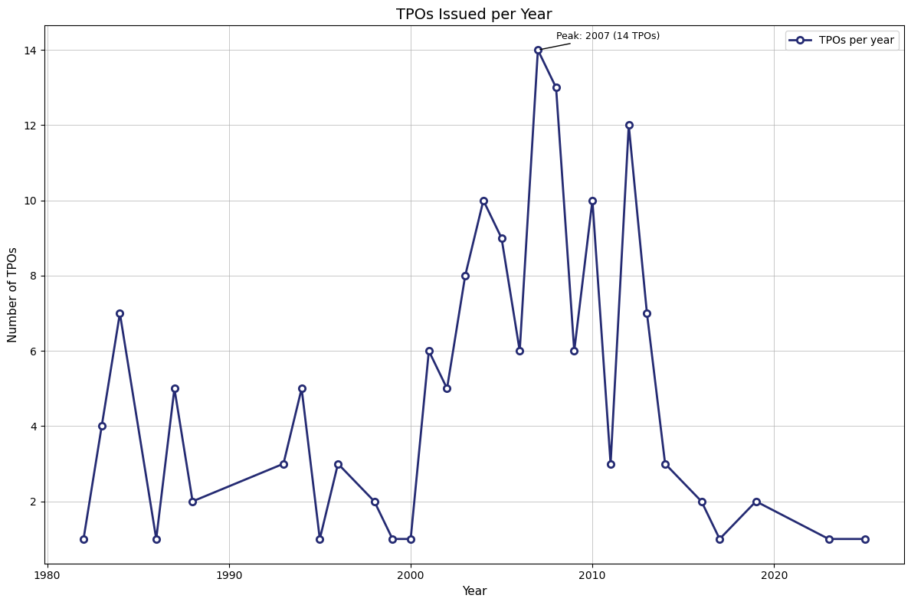
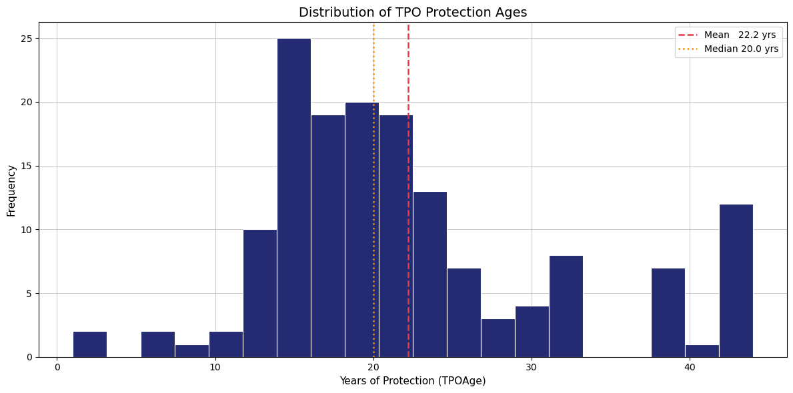
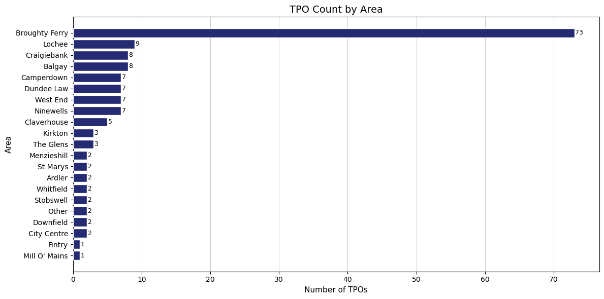

# Dundee Tree Protection Orders (TPOs)
This project explores the patterns, distribution, and characteristics of Tree Preservation Orders (TPOs) across Dundee, 
using a cleaned dataset of 155 records derived from the [TPO boundary](https://data.dundeecity.gov.uk/datasets/ee037194cfde49759544045a5f0e126c_0/about) 
dataset obtained from the Dundee Open Data portal. The analysis focuses on when TPOs were issued, how old they are today, and where they are most heavily concentrated.

**Data Quality Issue**:
Areas were assigned through a mix of Nominatim API lookups and manual verification, especially for addresses that were ambiguous or difficult to classify. 
A small degree of area‑matching uncertainty is acknowledged.

## Key Findings
- A major surge in TPOs occurred in the mid-2000s, especially 2003-2012.
- 2007 is the peak year with 14 TPOs.
- After 2012, TPO issuance declines sharply, with very few orders after 2016.
- TPO ages range from 1 to 44 years.
- Most TPOs are mature, not historic as they fall between 15-25 years old.
- Broughty Ferry has the highest number of TPOs by a substantial margin - over 8× more than the next area.

## TPOs per Year
A peak number of 14 TPOs were issued in 2007. 
TPO activity steadily increased from the early 2000s, forming a clear cluster of issued orders between 2003-2012 before dropping off sharply from 2012. Earlier small peaks appear in the 1980s, although these pale in comparison to the 2000s surge.  

## TPO Age Distribution
Years of protection range from 1 to 44 years, showing a spread from recently issued to longstanding protections. The median age is 20 years with a mean of around 22.2 years, and a majority of TPOs fall between the age of 15 and 25 years, which indicates that most TPOs are mature but not historic.  

  
## TPOs by Area
Broughty Ferry accounts for over 8 times more TPOs than any other area. The landscape of Broughty Ferry ranges from open coastal frontage along Douglas Terrace to the tree-lined streets of Dundee Road, with mature private gardens playing a significant role in shaping the townscape and contributing to the Conservation Area's historic identity.
This concentration of mature vegetation - both private and public, helps explain the high number of TPOs. Trees here are central to the area's setting, amenity, and heritage value.  

